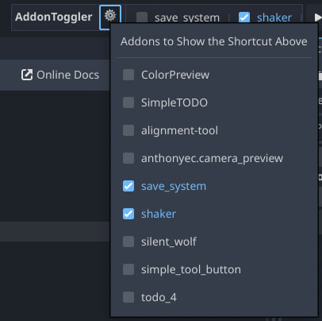

# godot-addon-toggler
Faster addon toggling for better addon development

### Install steps
- Clone the repo or download from the green `Code` button > Download Zip (Extract the zip after)
- Locate the `addon_toggler` folder inside the `addons` folder
- Copy the `addon_toggler` folder and paste it inside **your project's** `addons` folder
- Inside your Godot Editor, `Project > Project Settings > Plugins tab`
- Enable the `Addon Toggler` addon by clicking the unchecked checkbox

### Screenshots

